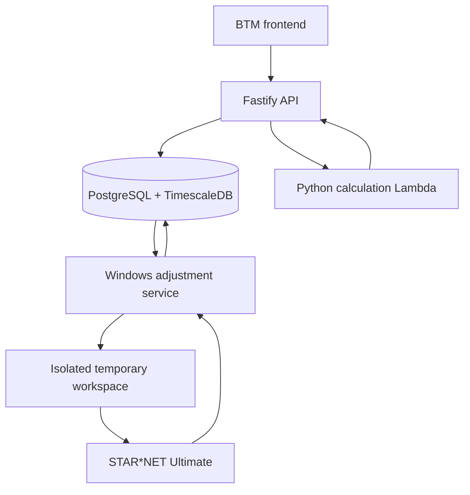

# Architecture cible — intégration réelle dans BTM

## 1. Décisions d'architecture

- Ajouter un nouveau `processing_type` : `Topographic Adjustment`.
- Ne pas réutiliser `Theodolite`.
- Créer la nouvelle surface API sous Fastify/TypeScript/Zod ; ne pas ajouter de nouvelles routes Express.
- Créer la feature frontend dans le stack moderne coexistant de BTM.
- Exécuter STAR*NET Ultimate sur un service Windows dédié.
- Utiliser la Lambda Python stateless pour validation, corrections, synchronisation,
  initialisation et essais du laboratoire ; ne jamais y exécuter STAR*NET.
- Ne pas utiliser S3 : les fichiers temporaires restent sur le worker Windows.
- Utiliser PostgreSQL/TimescaleDB comme source de vérité.
- Générer tous les fichiers STAR*NET à chaque run ; ne pas dépendre de fichiers historiques.

## 2. Vue logique



Le service Windows peut surveiller une table de jobs en base. Cela évite une dépendance à une
queue cloud tout en permettant concurrence, retries et idempotence.

## 3. Chaîne BTM existante

Le processing est représenté par une ligne `treatments`. Ses variables de sortie sont des lignes
`variables` dont `processing_id` pointe vers le traitement. Les données brutes restent dans
`raw_data` et les résultats dans `measures`.

Toutes les requêtes TimescaleDB portent une fenêtre temporelle bornée.

## 4. Composants proposés

### 4.1 Frontend feature

Emplacement indicatif :

```text
packages/front/src/features/topographic-adjustment/
  api/
  components/
  domain/
  hooks/
  i18n/
  pages/
  schemas/
  tests/
```

Utiliser MUI 5, TanStack Query v5, React Router v6, react-hook-form, Zod et react-i18next. Le
runtime BTM reste React 17 avec types React 18 tant qu'un nouvel ADR ne le remplace pas : le code
de feature réutilisable évite donc les API runtime React 18. Le shell autonome Vercel peut avoir
son propre bootstrap Vite/React 18 sans faire fuiter cette dépendance dans la feature. Le locale
reste synchronisé avec la source Redux existante via le bridge i18n décidé dans BTM.

### 4.2 Fastify API

Responsabilités :

- CRUD du processing ;
- CRUD transactionnel des versions de configuration ;
- validation des invariants ;
- résolution/consultation des variables BTM ;
- création de jobs manuels/reprocessing ;
- lecture des runs, diagnostics et aperçus ;
- création stable des variables de sortie.

Les writes d'une configuration complète doivent être atomiques. Le frontend envoie l'état final
du draft ; le serveur valide puis écrit la version dans une transaction.

### 4.3 Windows adjustment service

Responsabilités :

- réclamer un job de manière exclusive ;
- résoudre la version valide pour le slot ;
- lire les observations et T/P bornées ;
- sélectionner les cycles et construire le snapshot ;
- générer `.dat` et `.snproj` ;
- acquérir la ressource/licence STAR*NET si l'exécution doit être sérialisée ;
- exécuter STAR*NET/Auto Adjust ;
- parser `.lst`, `.pts`, `.err` et autres sorties natives nécessaires ;
- UPSERT les mesures et écrire le statut du run dans une transaction ;
- supprimer le dossier temporaire après confirmation de l'ingestion.

### 4.3a Lambda Python de calcul

Responsabilités : validation du snapshot résolu, regroupement/sélection des cycles station,
corrections de distance tracées, coordonnées initiales et essais moindres carrés/Auto Adjust du
laboratoire. Elle est stateless, ne lit pas directement la base et ne publie aucune mesure.

### 4.4 Job queue PostgreSQL

Table logique recommandée, à adapter au schéma réel :

```text
topographic_adjustment_jobs
- id
- processing_id
- output_slot
- trigger: event | schedule | manual | catch_up | reprocess | test
- requested_config_version_id nullable
- status: queued | claimed | running | succeeded | failed | cancelled
- available_at
- claimed_by / claimed_at
- attempt_count
- idempotency_key unique
- created_at / updated_at
```

Réclamation : transaction avec `FOR UPDATE SKIP LOCKED`. Une clé idempotente empêche deux jobs
équivalents de publier deux fois le même slot.

## 5. Modèle de configuration

Un processing possède plusieurs versions en base. Chaque version contient un snapshot métier
complet ou des références immuables vers :

- stations et variables d'entrée ;
- configurations de mesure ;
- mappings de points physiques et noms moteur ;
- références et coordonnées initiales ;
- paramètres STAR*NET ;
- politique de run ;
- politique de sortie ;
- origine des templates et overrides ;
- date de validité, auteur et justification.

Le choix entre JSONB résolu et tables normalisées peut être adapté au schéma de l'équipe. Les
invariants, IDs et contrats exposés dans `domain/21-CONTRATS-DE-DONNEES.md` doivent rester stables.

## 6. Variables d'entrée

Le mapping est explicite et versionné. Ne jamais déduire le rôle d'une variable depuis son nom.

Pour chaque cible/prisme BTM :

- `hzVariableId` ;
- `vzVariableId` ;
- `sdVariableId` ;
- station associée ;
- capteur/prisme propriétaire ;
- point physique de la version.

Les variables température/pression peuvent appartenir à la station, à un capteur environnemental
ou à un autre parent BTM. Elles sont sélectionnées explicitement dans la politique atmosphérique.

## 7. Variables de sortie stables

Créer les variables au niveau du processing, pas dans chaque version. Un mapping stable relie :

```text
processing + prism/target + component → variable_id
```

Le mapping physique reste versionné séparément :

```text
config_version + physical_point + prism/target + engine_name
```

Le chemin d'un résultat est :

`engineName → mapping de la version → cible(s) BTM → variable de sortie stable`.

Un point physique partagé produit une seule coordonnée STAR*NET. Cette coordonnée peut être
diffusée vers les variables stables de toutes les cibles BTM actives liées à ce point.

## 8. Écriture des mesures

Une seule valeur existe par `variable_id + timestamp` :

```sql
INSERT INTO measures (variable_id, timestamp, value)
VALUES ($1, $2, $3)
ON CONFLICT (variable_id, timestamp)
DO UPDATE SET value = EXCLUDED.value, created_at = now();
```

Les valeurs d'un même run sont écrites dans une seule transaction avec son statut de run. En cas
d'échec de parsing ou d'écriture, aucune publication partielle ne doit rester.

## 9. Journal de run minimal

Ne pas dupliquer les coordonnées dans la table des runs. Les séries finales vivent dans
`measures`.

Conserver au minimum : processing, config version, output slot, trigger, début/fin, statut,
station epochs utilisées/réutilisées/manquantes, nombre de tentatives Auto Adjust, indicateurs QC
résumés et erreur technique. Les listes volumineuses peuvent être résumées ou stockées avec une
politique de rétention décidée par l'équipe.

## 10. Dossiers temporaires

Un exemple d'isolation :

```text
C:\BTM-StarNet\work\{processingId}\{runId}\
  input.dat
  project.snproj
  output.lst
  output.pts
  output.err
```

Les noms identiques dans cinq projets simultanés ne posent aucun problème car chaque run utilise
son dossier et son mapping. Si la licence STAR*NET ne permet qu'une exécution à la fois, sérialiser
l'appel au moteur sans sérialiser la préparation/parsing.

## 11. Suppression et échec

- supprimer le workspace seulement après commit réussi des mesures et diagnostics requis ;
- en cas d'échec, enregistrer code retour, étape, message, run ID et config version ;
- ne jamais considérer le workspace comme une archive ;
- une procédure de nettoyage peut supprimer les dossiers orphelins après un délai court ;
- aucun recalcul ne doit dépendre de leur présence.

## 12. Déclenchement

Le service peut combiner :

- un poll court des jobs manuels/catch-up/reprocessing ;
- un détecteur de nouvelles données basé sur watermarks ;
- une planification de slots par processing.

La logique métier reste dans un use-case partagé : `resolveDueSlots(processing, watermarks, now)`.
Le déclenchement ne définit jamais le timestamp publié ; la grille de sortie le fait.

## 13. Sécurité et audit

- authentification/autorisation via les mécanismes BTM existants ;
- toute création, activation, archivage, recalcul forcé ou changement de mapping est audité ;
- les overrides historiques exigent une justification ;
- les chemins et arguments STAR*NET sont construits sans interpolation de texte utilisateur ;
- noms moteur validés et assainis ;
- aucune commande shell composée à partir de labels libres.

## 14. Tests BTM

Conserver le modèle dual-track :

- Vitest + MSW et Playwright MSW pour le flux UI rapide ;
- Playwright contre Fastify + PostgreSQL réel pour contrats, versions, variables et UPSERT ;
- tests du service Windows sur génération/parsing avec fichiers golden ;
- un test d'intégration STAR*NET sur l'environnement Windows de CI/staging lorsque la licence le permet.
